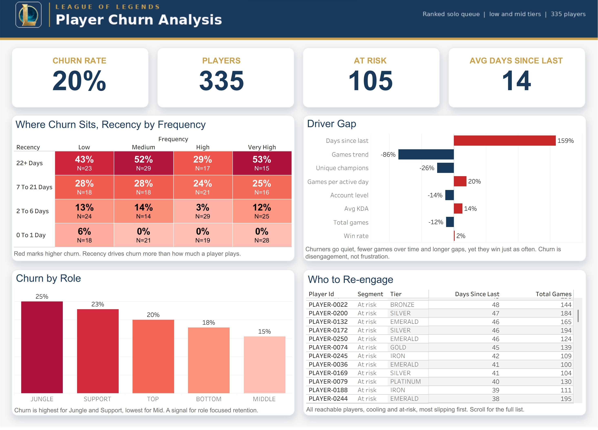
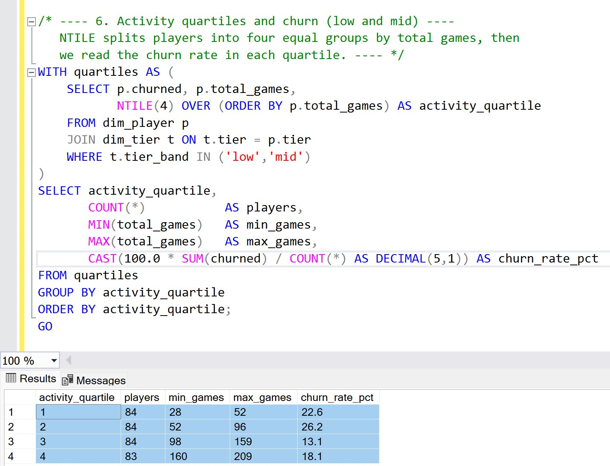
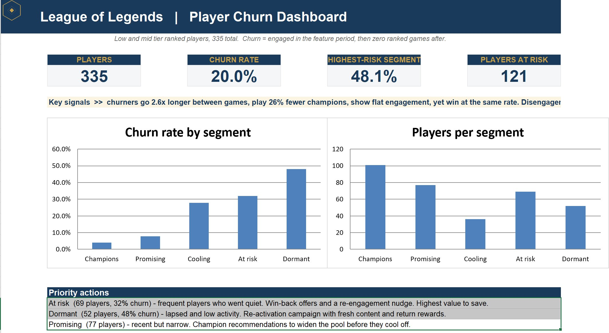

# League of Legends — Player Churn & Retention Analysis

An end-to-end data analyst project on original data pulled from the Riot Games API. It predicts which committed ranked players churn, identifies the behavioral signals that separate churned from retained players, and turns those signals into prioritized, testable retention actions — the kind of work a game analytics team does.

**[View the live dashboard on Tableau Public »](https://public.tableau.com/views/LoL-PlayerChurnAnalysis/Dashboard1)**



---

## Business question

What distinguishes a ranked player who keeps playing from one who quietly stops? Which behavioral patterns flag that risk early enough to act on, and where should a studio focus its retention effort?

---

## Data & methodology

The rigor lives here, before any chart is drawn.

- **Source:** Riot Games API (free developer key). Region EUW1, ranked solo queue (`RANKED_SOLO_5x5`, queue id 420).
- **Seed:** a stratified sample across all ten tiers from Iron to Challenger, equal players per tier, drawn from the live ranked ladder. Tier is kept as a feature.
- **Observation window:** six months per player, split into a **four-month feature period** and a **two-month outcome period**.
- **Engaged population:** a player is included only if they played at least **30 ranked games in the feature period**. The question is why *committed* players leave, not why casual players drift off.
- **Churn label:** a player is churned if they played **zero ranked games in the outcome period** after being active in the feature period.
- **Leakage-safe by design:** every behavioral feature, including `days_since_last`, is measured **as of the feature/outcome cutoff** — before the outcome is known. Recency therefore acts as a genuine leading indicator, not a circular restatement of the label.

### Population funnel

| Stage | Players | Note |
|---|---|---|
| Seeded from the ladder | 1,000 | stratified across tiers |
| Engaged (≥30 feature games) | 704 | committed players |
| **Low + mid tiers (analyzed)** | **335** | 67 churned → **20% churn** |
| High tier | 369 | **0% churn**, excluded |

High-tier churn is effectively zero because rank decay forces continued play, so there is no churn signal to learn there. Narrowing the churn analysis to the 335 low- and mid-tier players is a deliberate methodological choice, not a shortcut: it is the only place churn exists and the only place it can be prevented. The analysis rests on **105,637 parsed feature-period matches**.

---

## Key findings

**Churn is quiet disengagement, not frustration.** The strongest separator by far is recency: how long since a player's last ranked game at the cutoff. Players who had already gone quiet were far more likely never to return, regardless of how much they had played.

Compared with retained players, churned players showed:

- **+159%** days since last game (the dominant leading signal)
- **−86%** games trend (flat or declining activity, while retained players were still ramping up)
- **−26%** unique champions (narrower pools)
- **−14%** account level (newer accounts)
- **+20%** games per active day (burstier sessions)
- **+14%** average KDA and **+2%** win rate — i.e. they performed **as well or better**

That last point is the crux: churned players were not losing more or playing worse. They simply stopped showing up. A standardized logistic model confirms the ranking (AUC ≈ 0.72), with recency, total games, and activity trend on top and win rate near zero.

The recency-by-frequency heatmap makes it visual: the longer since a player was last seen, the higher the churn across **every** level of play volume. By role (low and mid tiers), churn is highest for **Jungle (25%)** and **Support (23%)** and lowest for **Mid (15%)**.

---

## Recommendations

These are framed as **hypotheses to validate with A/B tests**, not proven fixes. The data is observational, so it can motivate an intervention and predict who to target, but only an experiment can prove an intervention works.

1. **Act in the cooling window, not after.** The reachable group is the ~105 *cooling* and *at-risk* players (28–32% churn), not the *dormant* group (48% churn, largely already gone). Trigger re-engagement — a push or email — when a regular player's gap grows beyond their own baseline, before they lapse.
2. **Reduce early-tenure churn.** Churned players are newer accounts, and the hardest, least forgiving roles (Jungle, Support) churn most. Improve role-specific onboarding, or steer newcomers toward more forgiving roles first. *(Hypothesis to test.)*
3. **Encourage champion variety — cautiously.** Narrow champion pools correlate with churn, but this may be a symptom of fading interest rather than a cause. Worth testing exploration nudges; not worth asserting as fact.
4. **Do not chase skill or matchmaking.** Win rate is unchanged and KDA is higher among churners. Spending on "help them win more" would target the wrong problem.

Each recommendation pairs with a measurable success metric (return rate within the outcome window) so it can be run as a controlled experiment.

---

## SQL modeling layer

The processed data is loaded into **SQL Server** and modeled as a **star schema** — a `fact_player_match` table (one row per game) joined to `dim_player`, `dim_champion`, `dim_date`, and `dim_tier`. One practical detail: pandas writes text columns as `NVARCHAR(MAX)`, which SQL Server cannot index or key, so the build script re-types the join keys to `VARCHAR` before creating primary keys and indexes.

On top of the schema sit two query files:

- **Foundational** (`02_basic_queries.sql`): dataset overview, churn by tier band, churn by role (low/mid only), activity by hour and weekday, engagement segments built with `CASE`, and churn per tier with a `HAVING` floor on sample size.
- **Advanced** (`03_advanced_queries.sql`): window functions and CTEs — top-3 champions per tier with `ROW_NUMBER`, week-over-week activity with a running total (`SUM OVER`) and prior-week comparison (`LAG`), activity quartiles with `NTILE`, ISO-week handling, and each player's longest losing streak via a **gaps-and-islands** pattern:

```sql
-- Longest losing streak per player (gaps and islands)
WITH seq AS (
    SELECT puuid, win,
           ROW_NUMBER() OVER (PARTITION BY puuid ORDER BY game_start)            AS rn,
           ROW_NUMBER() OVER (PARTITION BY puuid, win ORDER BY game_start)        AS rn_win
    FROM fact_player_match
),
loss_runs AS (                       -- (rn - rn_win) is constant within a losing run
    SELECT puuid, (rn - rn_win) AS grp, COUNT(*) AS run_len
    FROM seq WHERE win = 0
    GROUP BY puuid, (rn - rn_win)
)
SELECT puuid, MAX(run_len) AS longest_loss_streak
FROM loss_runs GROUP BY puuid;
```



Full scripts in [`sql/`](./sql).

---

## Excel RFM segmentation

A self-contained **RFM workbook** (`excel/rfm_churn_analysis.xlsx`, ~1,800 live formulas, navy/gold theme) segments the 335 low/mid players on three axes scored 1–4 by quartile: **Recency** (days since last game, reversed), **Frequency** (total games), and **Engagement breadth** (unique champions). The scores combine into five named segments, each with its own churn rate:

| Segment | Players | Churn rate |
|---|---|---|
| Champions | 101 | 4% |
| Promising | 77 | 8% |
| Cooling | 36 | 28% |
| At risk | 69 | 32% |
| Dormant | 52 | 48% |

This is what drives the "act in the cooling window" recommendation: the **At-risk + Cooling group (105 players)** is still reachable, while the **Dormant group** is largely already gone. The workbook has eight sheets — `Dashboard` (KPIs, charts, a priority-actions panel), `Data`, `Cutoffs`, `Segments`, `RF_Heatmap`, `Drivers`, `Cuts`, and `About` — so the full scoring logic is transparent and auditable, not hidden in code.



Workbook in [`excel/`](./excel).

---

## Tech stack

- **Python** (pandas, scikit-learn / statsmodels, matplotlib) for ingestion, feature engineering, modeling
- **Riot Games API** for original match-level data
- **SQL Server** (`LoLChurnAnalysis`) for the star-schema modeling layer and analytical queries
- **Tableau** for the published dashboard
- **Excel** for the RFM segmentation workbook

---

## Repository structure

```
src/            Python ingestion & feature pipeline (Riot API → features)
data/           processed datasets (player_features.csv, player_match.csv)
notebooks/      01 collection · 02 cleaning · 03 features · 04 churn analysis · 05 Tableau prep
sql/            star schema build + foundational and advanced analytical queries
excel/          RFM segmentation workbook
tableau/        dashboard, data extracts, build guide
ai_comparison/  AI data tools vs. this manual workflow (see below)
images/         dashboard and chart exports
```

---

## AI data tools vs. this manual workflow

I gave the same labeled dataset to three AI analysis tools — **Bricks, Julius, and Quadratic** — and evaluated them against this manual analysis. The short version: Julius and Quadratic independently rediscovered most of the findings in minutes, while Bricks missed the tier-scoping call and chased a frustration red herring; Quadratic's logistic model also surfaced a loss-streak "driver" that its own group means did not support. The value of the project lived in the decisions the tools do not make on their own — a leakage-safe design, scoping to where churn exists, separating correlation from causation, and framing recommendations as experiments.

**[Read the full comparison »](./ai_comparison/AI_TOOLS_COMPARISON.md)**

---

## Limitations

- **Sampling.** The seed is drawn from the *current* ladder, so it captures players active enough to still appear on it; players who churned long ago and fell off the ladder are not represented. This is a survivorship consideration, and match volume rises toward recent months partly for the same reason (plus a January ranked-split reset).
- **Observational data.** Findings are correlational. Recommendations are hypotheses to be validated experimentally.
- **Scope.** Single region (EUW1), single ranked queue, a single point-in-time snapshot. The population is *committed* players (≥30 games), so conclusions generalize to engaged players rather than casual ones.
- **High-tier churn** is near zero partly for mechanical reasons (rank decay), which is why it is excluded from the churn analysis.

---

*Built by Tal Jacob. Original data, full pipeline, and analysis are reproducible from `src/` with a Riot API key.*
