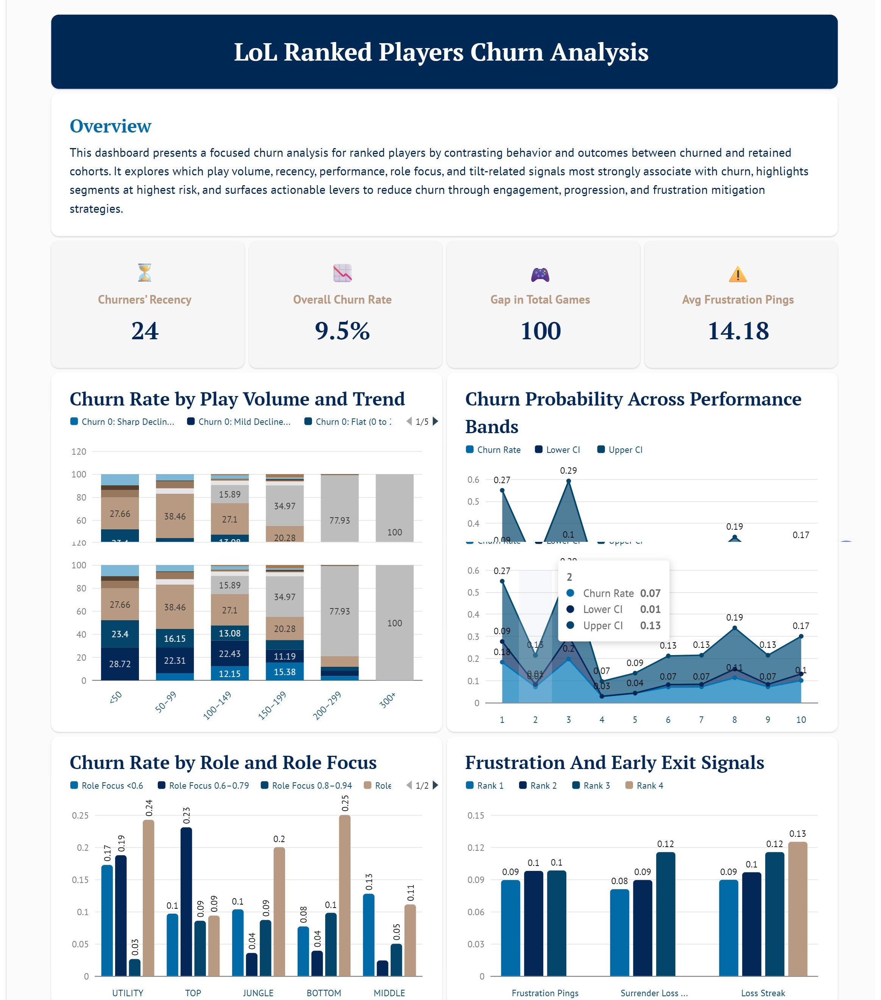
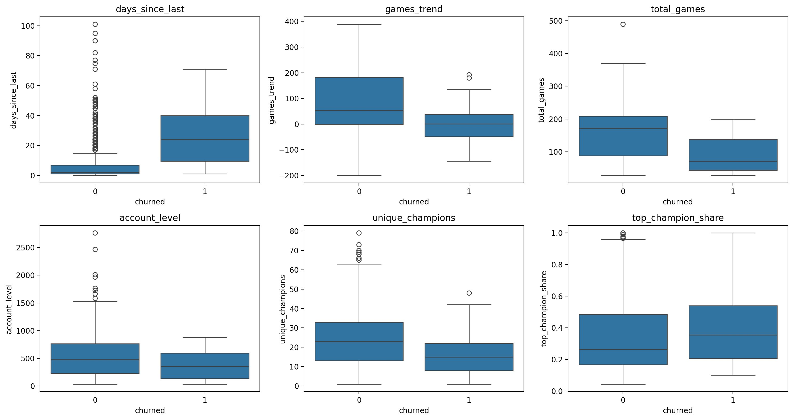
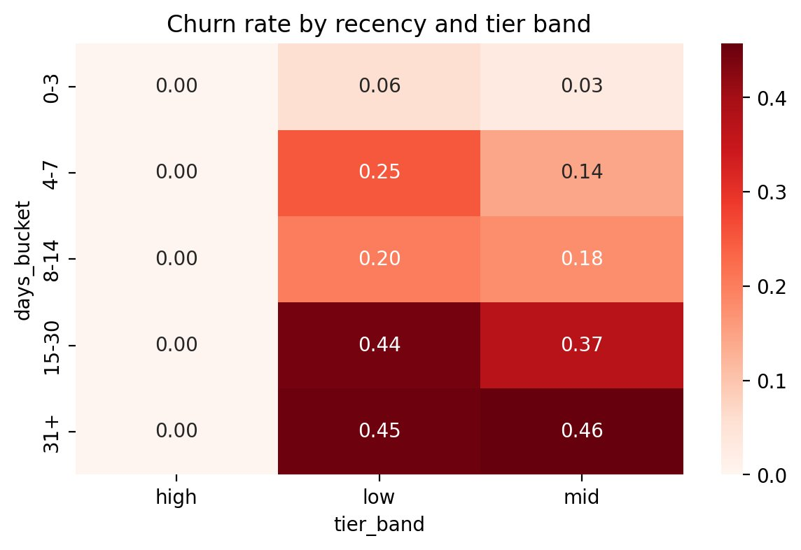
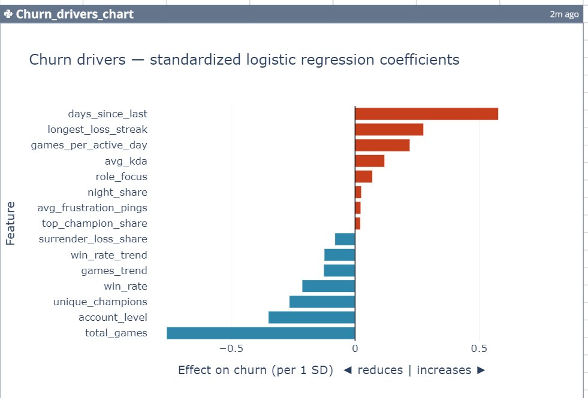
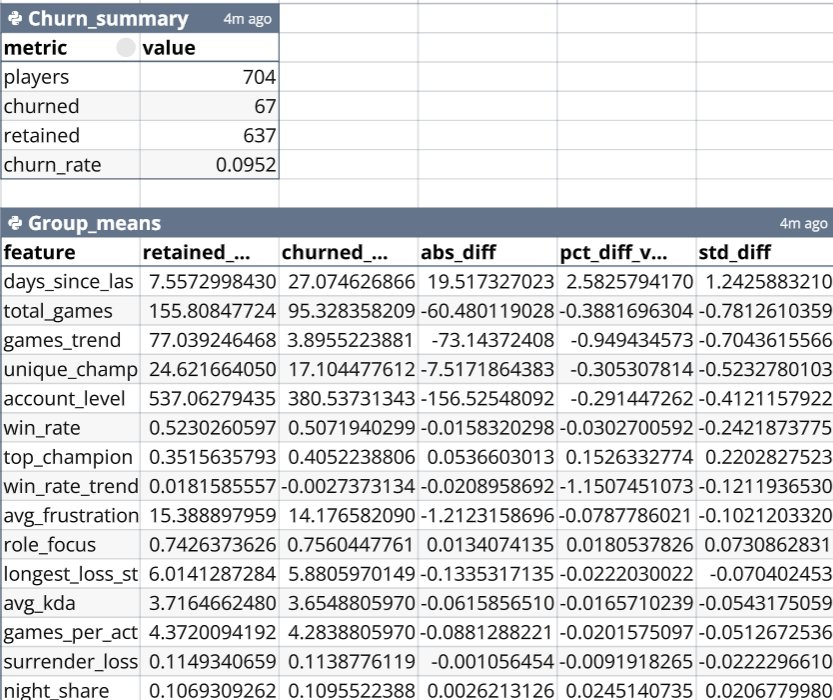
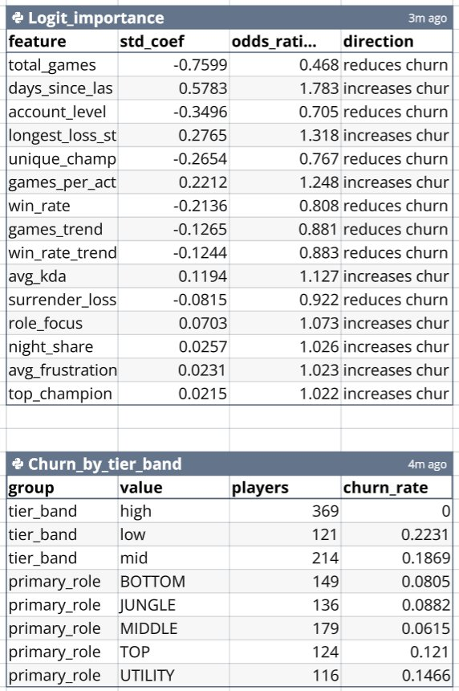

# AI Data Tools vs. a Rigorous Manual Workflow

## Why this experiment

I built this churn analysis by hand: a Python ingestion pipeline, a leakage-safe windowed study design, SQL modeling, and a Tableau dashboard. Then I gave the **same labeled dataset** to three AI data-analysis tools (**Bricks**, **Julius**, and **Quadratic**) and asked each the same question. The goal was not to crown a winner. It was to see where automated analysis genuinely helps, and where human judgment still decides the outcome.

## The fair test

- **Same file** for all three: `lol_churn_dataset.csv` (704 players, 19 behavioral features plus a churn label).
- **Same open prompt**, phrased the way a stakeholder would ask: *"Analyze what distinguishes churned from retained players, and recommend how to reduce churn. Be specific about which signals matter most."*
- One framing note that matters: the **entire upstream pipeline was manual**: collecting matches, defining churn, splitting a 4-month feature window from a 2-month outcome window to prevent leakage, and engineering the features. The tools only ever saw a clean, pre-labeled table. They enter at the analysis stage, not the data-engineering stage where much of the rigor lives.

## Scorecard

| Dimension | Bricks | Julius | Quadratic |
|---|---|---|---|
| Speed and effort | Very high | High | High |
| Caught the scoping call (high tier = 0% churn) | No | Yes | Yes |
| Statistical depth | Medium (added CIs) | High (effect sizes) | Highest (logistic regression + odds ratios) |
| Correct on "disengagement, not frustration" | No, over-weighted frustration | Yes | Yes |
| Causal honesty / proposed validation | Low | Partial | Partial |
| Visualization | Polished but cluttered | Clear | Clear |
| Transparency and reproducibility | Low (no-code, opaque groupings) | High (visible code) | High (auditable tables) |
| Recommendations | Generic | Segmented, aligned | Detailed (one unsupported) |

---

## Bricks: fast and polished, but missed the key calls

[Live output](https://app.thebricks.com/file/46893f95-014a-4365-8aa3-50885d153956/8513@d72f5b44-2a75-47ac-b872-bae6d0e14ae9:0/visual-board)

Bricks produced a full themed, multi-panel dashboard from one prompt in seconds, and it even layered confidence intervals onto one chart. Its overview text used careful correlational language ("associate with churn").

But it missed the two decisions that mattered most:

- **It never isolated the tiers.** It reported the blended all-tier churn rate of 9.5% and analyzed all 704 players together, never noticing that high-tier churn is exactly 0% and that the entire phenomenon lives in low and mid tiers.
- **It chased a red herring.** It promoted average frustration pings to a headline KPI, built a whole "Frustration and Early Exit Signals" panel, and recommended "frustration mitigation strategies." The data says the opposite: churned players win at the same rate and post higher KDA, so churn is quiet disengagement, not frustration. Bricks surfaced frustration mainly because the columns existed, and that would have pointed a stakeholder at the wrong lever.

It was also the least transparent: groupings like "Performance Bands 1 to 10" are undefined, and a "Gap in Total Games = 100" KPI does not match the real churned-vs-retained gap of about 13 games.

---

## Julius: nearly reproduced the manual analysis

[Live output](https://julius.ai/chat?id=fcfec5b6-ec2f-4d08-a90c-d11a1adbb4fc)

Julius independently arrived at the same conclusions as the manual analysis, including the parts Bricks missed:

- **It caught the scoping call.** It broke churn out by tier (low 22.3%, mid 18.7%, high 0%) and explicitly recommended concentrating retention on low and mid tiers because high-tier players are already sticky. Its recency-by-tier heatmap mirrors the centerpiece of my Tableau dashboard.
- **It rejected the frustration story.** It stated plainly that frustration pings, loss streaks, and surrender share were *not* top drivers, and that the mechanism is "gradual disengagement," not "rage-quitting."
- **It quantified effect sizes** that match the data exactly (27.1 vs 7.6 days since last; 95.3 vs 155.8 games; 17.1 vs 24.6 unique champions) and built a three-segment retention playbook.

Where the human still added value: Julius stated its recommendations with confidence but did not explicitly separate correlation from causation, nor propose A/B tests to validate them. And, like every tool here, it never touched the upstream leakage-safe design.

---

## Quadratic: the most rigorous model, and one instructive trap

[Live output](https://app.quadratichq.com/file/e39c96dc-57d0-4a9e-aac3-a0151056a4e2)

Quadratic was the most statistically serious of the three. It fit a standardized logistic regression, reported odds ratios, computed standardized effect sizes, and built its driver chart from model coefficients rather than raw differences. It caught the tier scoping ("all the action is in low and mid tiers") and concluded that skill barely moves churn. Its outputs are auditable tables you can reuse.

It also produced the single most instructive moment of the whole comparison:

- Quadratic elevated **`longest_loss_streak`** to a top-five driver based on its logistic coefficient (odds ratio 1.32) and recommended a "loss-streak circuit breaker."
- But its own group-means table shows loss streak is **nearly identical** between churned (5.88) and retained (6.01) players, a standardized difference of only -0.07.
- The positive coefficient is a multivariate suppressor artifact, not a real marginal effect. Trusting the coefficient without checking it against the raw means produced a recommendation the data does not support.

This is exactly the kind of trap a careful analyst catches by cross-checking model coefficients against the marginal distributions. The tool did not. Quadratic also computed churn by role on all tiers blended, so its role ranking differs from the low/mid-scoped view it had itself recommended.

---

## What the tools got right, collectively

The core story emerged from automated analysis in minutes, especially from Julius and Quadratic: **recency and declining activity dominate churn, while skill and win rate do not.** These tools dramatically lower the barrier to a credible first pass, and at their best they reproduced findings that took days to build by hand.

## Where human judgment still decided the outcome

- **The study design.** Defining churn, splitting feature and outcome windows to prevent leakage, and engineering the features were all manual. The tools never saw this stage, and it is where most of the validity comes from.
- **Scoping to where churn exists.** Julius and Quadratic caught the high-tier-zero pattern; Bricks did not. A human made it explicit and central rather than a footnote.
- **Correlation versus causation.** All three stated interventions confidently. The manual analysis framed every recommendation as a hypothesis to be validated with an A/B test, not a proven fix.
- **Cross-checking the model against the data.** Quadratic's loss-streak recommendation shows why you never trust a coefficient in isolation.
- **Rejecting the obvious-but-wrong lever.** Bricks chased frustration; the data, and the more careful tools, rejected it.

## Bottom line

AI data tools are powerful accelerators for exploration, modeling, and charting. Julius and Quadratic independently rediscovered most of this analysis in minutes, and that is genuinely useful. But the value of the project lived in the decisions the tools do not make on their own: a leakage-safe design, scoping to where the phenomenon actually exists, separating correlation from causation, validating coefficients against the raw data, and framing recommendations as experiments rather than conclusions. The tools are a strong co-pilot. They are not yet a replacement for analytical judgment.
